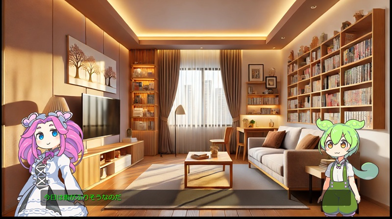

# ずんだもん寸劇　ブラウザープレイヤー



## 概要

ずんだもんと四国めたんの寸劇をシナリオファイルを書けばブラウザで再現できるJSエンジンです

## 準備

VOICEVOXをインストール　https://voicevox.hiroshiba.jp/

VOICEVOXを起動してサーバーAPIを使用

##　手順1 シナリオのライティング

シナリオファイルを書くscenario2.json などを変更
scenario2.jsonにあわせてプログラムやLLM等で生成してもよい

## 手順2 シナリオJSONを読み込み音声をVOICEVOXで生成するツールを実行

### BUILD

```
go build -o voice_generator main.go
```

Windows用にコンパイル（WSLやMacでWindowsバイナリを出力したいとき）

```
GOOS=windows go build -o voice_generator.exe main.go
```

### 実行
```
./voice_generator scenario2.json 
```

## サーバー経由でindex.htmlをブラウザで開く

VSCodeの「Live Preview拡張」などサーバー経由でindex.htmlを開く（リソース読み込みのため）


## 寸劇サンプル動画

https://youtu.be/xfD-iXySyfA


## イラストなど素材元

ずんだもんの音声　https://voicevox.hiroshiba.jp/

イラスト　https://www.the-time.jp/tachie/

イラスト素材のPSDのパース　https://oov.github.io/psdtool/
